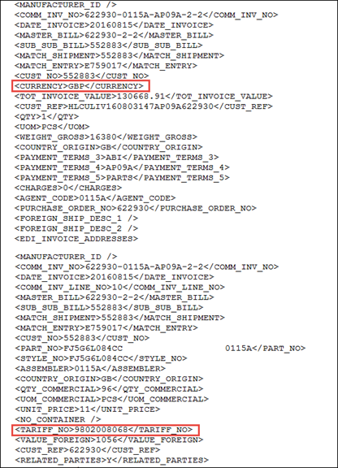

# U.S. Customs EDI Sub-Network
<pre>
status: draft 0.0.4
date: June 4th, 2020
</pre>

##  Overview 
We have the following CPB queries available for submission and response through the ACE system:

•	ACE Extract Reference Query – Returns Reference File codes and information for various CBP data.
•	ACE MID Query – Determines whether manufacturer name and address are on file with CBP.
•	ACE PGA/FDA Reference Query – Returns Reference File information for product and compliance codes.
•	ACE Quota Query – Returns import quotas based on country, tariff number, and/or textile category.
Customs Management enables you to submit these queries to CPB, and receive and view responses using the ABI Results screen. These features are described in the following Help topics:

•	ACE Extract Reference File Query
- Submitting and Viewing Extract Reference Queries
- Viewing and Printing Extract Reference Queries
•	ACE MID Query
- Submitting and Viewing MID Queries
- Viewing and Printing MID Query Responses
•	ACE PGA/FDA Reference File Queries
- Submitting FDA Queries
- Viewing and Printing FDA Queries and  Responses
•	ACE Quota Query
- Submitting Quota Queries
- Viewing and Printing Quota Query Responses
- Message and Response Formats

## Container Management 

A container can be picked up for delivery once it has been released. A container release status is updated as follows:

•	When you receive the Cargo Release response (SO message) with the SO60 record that has the disposition code '01' (ONE USG).
•	When you receive the Release Date Update response (RR message).
•	When you receive ACE Cargo Release query response (C1 message).
•	When you update any detail on the Container screen and click the Save button.
A container is considered released when the entry has been released (CBP and PGA) and a container record has a Late Free Date and Pick up number.

## Creating an EDI Shipment with our TradeDocs Platform

Shipment details in the EDI repository can remain in the EDI tables until you manually load the data to create a shipment if Customs Management is not set up for the customer to automatically process and send them to Customs. (For example, CR Cert, CR/ES, or ES Cert was not selected when the Hands Free/Lights Out Entry was configured.) Once the Load EDI Shipment record is created with a Master Kit in the Part field, the Master Kit Record creates a line for each of its component part line items, defaulting the quantity and value for each and defaulting the Tariff detail for each component.

## Foreign Currency to USD (9802)

Customs Management now provides customer’s specific functionality to convert the foreign currency value of Commercial Invoice Tariff Lines to USD when the Commercial Invoice data (EDI Invoice button on the Comm. Inv. tab) is pulled from EDI and if the Commercial Invoice contains “9802” (first 4 digits) HTS line. Customs Management will convert all the Tariff Lines from an EDI invoice file that are in foreign currency (except 9802 line) to USD and deduct the 9802 tariff line amount that is in USD from 2nd HTS Line to arrive the net dutiable line value. The currency exchange rate is taken from the Currency Rate table based on the Export Date given in the shipment header.

The following is an example of EDI Commercial Invoice XML data that contains HTS code 9802 and foreign currency to be process through EDI for testing.

